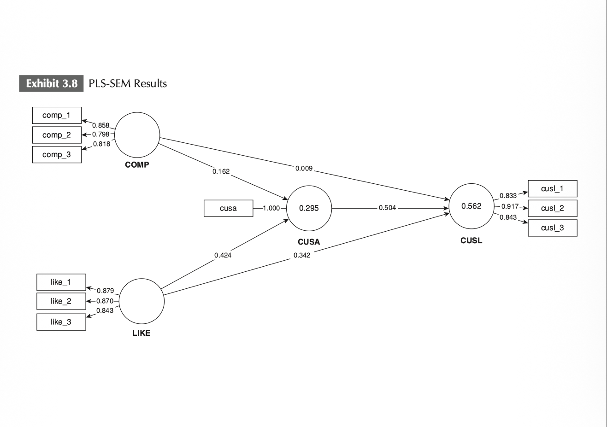

# GVB Structural Model Visualization (GVB-SMV) v1.0

### From Statistical Results to Scientific Communication

A custom R-based framework for publication-ready visualization of PLS-SEM results.

---
## 🇬🇧 Overview

GVB Structural Model Visualization (GVB-SMV) is a custom R-based visualization framework developed by **Giau V. Bui (GVB)** to improve the communication, interpretation, and dissemination of Partial Least Squares Structural Equation Modeling (PLS-SEM) results.

Although modern SEM software provides comprehensive statistical outputs, researchers often need to navigate multiple tables, bootstrap reports, and result windows before obtaining a complete understanding of the structural model. This fragmented workflow can reduce interpretability and make the communication of research findings more challenging, particularly in publication-oriented studies.

GVB-SMV was developed as a visualization layer that complements existing PLS-SEM software by integrating key statistical outputs into a single publication-ready figure. The framework combines standardized path coefficients (β), bootstrap confidence intervals (95% CI), t-values, explanatory power measures (R²), significance indicators, and moderation effects within a unified visual representation.

Rather than replacing SmartPLS, `seminr`, or other SEM software, GVB-SMV aims to enhance scientific communication, improve research transparency, and facilitate the visual presentation of empirical findings. By consolidating statistical information that is typically distributed across multiple SEM outputs, the framework enables researchers to interpret structural relationships more efficiently and communicate results more effectively.

The current version was developed using outputs generated from the `seminr` package (version 2.3.7) in R. GVB-SMV has been successfully applied to support publication-oriented visualization in peer-reviewed research, including the article **"The metaverse effect: can virtual tourism experiences drive actual visits?"**, published in *Tourism Review* (Emerald Publishing).

This repository provides the official public release of GVB-SMV as an open-source visualization framework for researchers using PLS-SEM in academic and applied research.

---

## 🇻🇳 Tổng quan

GVB Structural Model Visualization (GVB-SMV) là một khung trực quan hóa tùy chỉnh được phát triển bằng ngôn ngữ R bởi **Giau V. Bui (GVB)** nhằm nâng cao khả năng truyền đạt, diễn giải và phổ biến kết quả nghiên cứu sử dụng mô hình bình phương tối thiểu từng phần trong mô hình phương trình cấu trúc (Partial Least Squares Structural Equation Modeling – PLS-SEM).

Mặc dù các phần mềm SEM hiện đại cung cấp đầy đủ các kết quả thống kê, nhà nghiên cứu thường phải xem xét nhiều bảng kết quả, báo cáo bootstrap và cửa sổ phân tích khác nhau trước khi có được cái nhìn toàn diện về mô hình cấu trúc. Quy trình phân tán này có thể làm giảm tính trực quan và gây khó khăn trong việc truyền đạt kết quả nghiên cứu, đặc biệt trong các công bố học thuật.

GVB-SMV được phát triển như một lớp trực quan hóa bổ sung cho các phần mềm PLS-SEM hiện có bằng cách tích hợp các kết quả thống kê quan trọng vào một hình trực quan duy nhất, sẵn sàng cho công bố. Framework này kết hợp hệ số đường dẫn chuẩn hóa (β), khoảng tin cậy bootstrap (95% CI), giá trị *t*, hệ số giải thích (R²), chỉ báo ý nghĩa thống kê và các hiệu ứng điều tiết trong một biểu diễn trực quan thống nhất.

Thay vì thay thế SmartPLS, `seminr` hay các phần mềm SEM khác, GVB-SMV hướng đến việc nâng cao khả năng truyền đạt khoa học, cải thiện tính minh bạch của nghiên cứu và hỗ trợ trình bày trực quan các kết quả thực nghiệm. Bằng cách tổng hợp các thông tin thống kê vốn thường phân tán ở nhiều đầu ra SEM khác nhau, framework giúp nhà nghiên cứu diễn giải các mối quan hệ cấu trúc hiệu quả hơn và truyền đạt kết quả rõ ràng hơn.

Phiên bản hiện tại được phát triển dựa trên các kết quả đầu ra từ gói `seminr` (phiên bản 2.3.7) trong môi trường R. GVB-SMV đã được áp dụng để hỗ trợ trực quan hóa kết quả phục vụ công bố trong các nghiên cứu đã qua bình duyệt, bao gồm bài báo **“The metaverse effect: can virtual tourism experiences drive actual visits?”**, được xuất bản trên *Tourism Review* của Emerald Publishing.

Kho lưu trữ này cung cấp phiên bản phát hành công khai chính thức của GVB-SMV dưới dạng một framework trực quan hóa mã nguồn mở dành cho các nhà nghiên cứu sử dụng PLS-SEM trong nghiên cứu học thuật và nghiên cứu ứng dụng.

---

# Key Features

GVB-SMV integrates multiple structural model outputs into a single publication-ready figure:

- Standardized Path Coefficients (β)
- Bootstrap Confidence Intervals (95% CI)
- t-values
- Significance Indicators
- Moderating / Interaction Effects
- R² Values
- Visual Emphasis Based on Effect Strength
- Publication-Oriented Layout

---

# Example Visualization

This section illustrates how GVB-SMV complements conventional SEM visualization by integrating statistical information that is often distributed across multiple outputs.

---

## 1. Conventional SEM Output (SmartPLS)

The figure above illustrates a conventional structural model visualization generated by SmartPLS. This type of diagram commonly presents standardized path coefficients, outer loadings, and explanatory power measures such as R².

Although these outputs are essential for SEM analysis, additional information such as bootstrap confidence intervals, t-values, significance levels, and moderation effects is usually reported in separate tables, reports, or result windows. As a result, researchers often need to combine multiple outputs manually before interpreting the overall structural model.

---

## 2. GVB Structural Model Visualization (GVB-SMV)

The figure above presents the GVB-SMV structural model visualization. Compared with conventional SEM diagrams, GVB-SMV integrates multiple statistical outputs into a single publication-oriented figure.

The visualization combines:

- Standardized Path Coefficients (β)
- Bootstrap Confidence Intervals (95% CI)
- t-values
- Significance Indicators
- Moderating / Interaction Effects
- R² Values
- Visual Emphasis Based on Effect Strength

This integrated representation allows researchers to interpret structural relationships, statistical significance, explanatory power, and interaction effects within a unified visual framework.

---

## 3. Moderation Analysis Visualization

The figure above illustrates the moderation analysis component of GVB-SMV through simple slope visualization.

This visualization helps researchers examine how the relationship between variables changes across different levels of a moderator. Compared with numerical moderation tables alone, simple slope plots provide a clearer and more intuitive interpretation of interaction effects.

---

# Purpose

GVB-SMV is **not intended to replace SmartPLS, `seminr`, or other SEM software**.

Instead, it aims to complement existing SEM outputs by improving:

- Research communication
- Interpretation of findings
- Academic reporting
- Publication-oriented visualization
- Open science dissemination

---
## Academic Application and Research Adoption

GVB-SMV has been applied to support the publication-oriented visualization of PLS-SEM structural model and moderation analysis results in peer-reviewed academic research.

### Published Application

Huynh, A. D. T., Pham, T. H., Quach, H. V., and Le, Q. T. C. (2026).

*The metaverse effect: can virtual tourism experiences drive actual visits?*

*Tourism Review*, ahead-of-print. Emerald Publishing.

https://doi.org/10.1108/TR-10-2025-1273

In this study, the GVB-SMV visualization approach was used to present the structural model and moderation analysis results. The publication-oriented figures integrate standardized path coefficients, bootstrap confidence intervals, t-values, significance indicators, interaction effects, and R² values within unified structural model diagrams.

This published application demonstrates the practical value of GVB-SMV for communicating complex PLS-SEM findings clearly and effectively in peer-reviewed academic research.

---
## License and Use

GVB-SMV is released under the MIT License.

Researchers are welcome to use, adapt, and extend the framework provided that appropriate attribution is given to the original author.

---
## Author

Giau V. Bui (GVB)

Independent Researcher

Research Interests:

- Data Science
- Artificial Intelligence
- Digital Economy
- PLS-SEM
- Statistical Visualization
- Research Methods

ORCID:

https://orcid.org/0009-0002-4547-3162

---

# Citation

If you use GVB-SMV in your research, please cite:

Bui, G. V. (2026). *GVB Structural Model Visualization (GVB-SMV) v1.0*. GitHub Repository.

https://github.com/Kevinvanbui/GVB-Structural-Model-Visualization

---

# Current Release

GVB-SMV v1.0

Release Date: June 2026

---

# Keywords

PLS-SEM • SEM • SmartPLS • seminr • Data Visualization • R Statistics • Moderation Analysis • Structural Equation Modeling • Research Methods • Academic Publishing • Open Science
