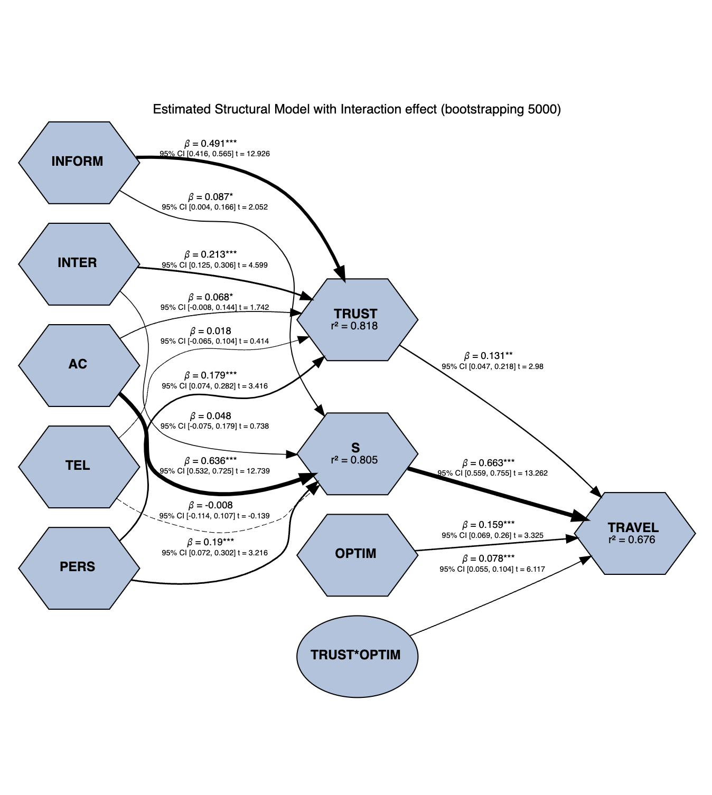
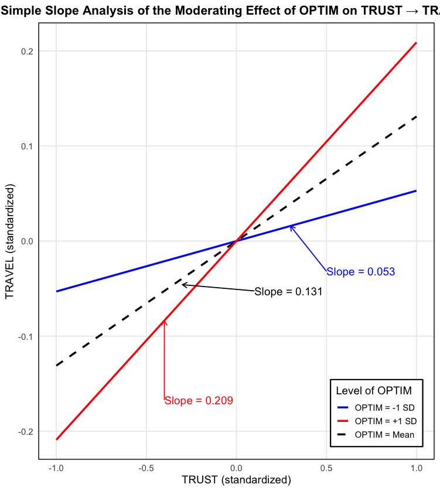

# GVB Structural Model Visualization (GVB-SMV) v1.0

### From Statistical Results to Scientific Communication

A custom R-based framework for publication-ready visualization of PLS-SEM results.

---

## 🇬🇧 Overview
GVB Structural Model Visualization (GVB-SMV) is a custom R-based visualization framework developed by Giau V. Bui (GVB) to enhance the communication, interpretation, and dissemination of Partial Least Squares Structural Equation Modeling (PLS-SEM) results.

Although modern SEM software provides extensive statistical outputs, researchers often need to navigate multiple tables, bootstrap reports, and result windows before obtaining a comprehensive understanding of the structural model. This fragmentation may reduce interpretability and make the communication of findings more challenging, particularly in academic publications.

GVB-SMV was developed as a visualization layer that complements existing PLS-SEM software by integrating key structural model information into a single publication-oriented figure. The framework combines path coefficients, bootstrap confidence intervals, t-values, explanatory power measures (R²), and interaction effects within a unified visual representation.

The primary objective of GVB-SMV is not to replace SmartPLS, seminr, or other SEM tools, but rather to improve scientific communication, research transparency, and the visual presentation of empirical findings.

The current version was developed using outputs generated from the seminr (v2.3.7) package in R and has been applied in a study accepted for publication in Tourism Review (Emerald Publishing, Q1).

---

## 🇻🇳 Tổng quan
GVB Structural Model Visualization (GVB-SMV) là một khung trực quan hóa được phát triển bằng ngôn ngữ R nhằm nâng cao khả năng trình bày, diễn giải và truyền đạt kết quả nghiên cứu sử dụng mô hình PLS-SEM.

Mặc dù các phần mềm SEM hiện nay cung cấp đầy đủ các kết quả thống kê cần thiết, nhà nghiên cứu thường phải tổng hợp thông tin từ nhiều bảng kết quả, báo cáo bootstrap và cửa sổ phân tích khác nhau trước khi có thể hình thành một bức tranh tổng thể về mô hình nghiên cứu. Điều này có thể làm giảm tính trực quan và gây khó khăn trong quá trình truyền đạt kết quả nghiên cứu.

GVB-SMV được phát triển như một lớp trực quan hóa bổ sung cho các phần mềm PLS-SEM hiện có, bằng cách tích hợp các thông tin quan trọng của mô hình cấu trúc vào cùng một sơ đồ. Framework này kết hợp hệ số đường dẫn (β), khoảng tin cậy bootstrap (95% CI), giá trị t, hệ số giải thích (R²) và các hiệu ứng điều tiết trong một biểu diễn trực quan thống nhất.

Mục tiêu của GVB-SMV không phải là thay thế SmartPLS, seminr hay các phần mềm SEM khác, mà là hỗ trợ nâng cao khả năng truyền đạt học thuật, tăng tính minh bạch của nghiên cứu và cải thiện chất lượng trình bày kết quả trong các công bố khoa học.

Phiên bản hiện tại được phát triển dựa trên kết quả đầu ra từ gói seminr (v2.3.7) trong môi trường R và đã được ứng dụng trong một nghiên cứu được chấp nhận đăng trên Tourism Review (Emerald Publishing, Q1).

---

# Key Features

GVB-SMV integrates multiple structural model outputs into a single publication-ready figure:

- Standardized Path Coefficients (β)
- Bootstrap Confidence Intervals (95% CI)
- t-values
- Significance Indicators
- Moderating / Interaction Effects
- R² Values
- Visual Emphasis Based on Effect Strength
- Publication-Oriented Layout

---

# Example Visualization

## Structural Model Visualization

The figure integrates path coefficients, confidence intervals, t-values, interaction effects, and explanatory power measures into a single structural model.

---

## Moderation Analysis Visualization

GVB-SMV also supports moderation effect visualization through simple slope analysis, facilitating the interpretation of interaction mechanisms within structural models.

---

# Purpose

GVB-SMV is **not intended to replace SmartPLS or other SEM software**.

Instead, it aims to complement existing SEM outputs by improving:

- Research communication
- Interpretation of findings
- Academic reporting
- Publication-oriented visualization
- Open science dissemination

---

# Academic Application

A version of the GVB-SMV framework was applied in a research study accepted for publication in Tourism Review (Emerald Publishing, Scopus Q1).

The framework was used as a visualization tool for communicating structural model results and moderation effects.

---

# Author

**Giau V. Bui (GVB)**

Research Interests:

- Data Science
- Artificial Intelligence
- Digital Economy
- Research Methods
- PLS-SEM
- Statistical Visualization

ORCID:

https://orcid.org/0009-0002-4547-3162

---

# Citation

If you use GVB-SMV in your research, please cite:

Bui, G. V. (2026).

GVB Structural Model Visualization (GVB-SMV) v1.0.

GitHub Repository.

https://github.com/Kevinvanbui/GVB-Structural-Model-Visualization

---

# Current Release

GVB-SMV v1.0

Release Date: June 2026

---

# Keywords

PLS-SEM • SEM • SmartPLS • Data Visualization • R Statistics • Moderation Analysis • Structural Equation Modeling • Research Methods • Academic Publishing • Open Science
